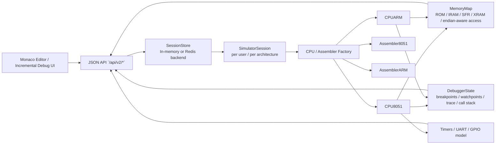

# HexaLogic `sim8051` Redesign

## 1. Refactored Architecture



### Design Goals

- No host-memory access, no subprocess execution, no filesystem persistence.
- All state held in Python memory structures only.
- One isolated `SimulatorSession` per user session.
- Architecture switching via CPU / assembler factory without shared state leakage.
- PC-driven execution from ROM, not mnemonic callstack replay.
- Backend returns JSON only for the new simulator path.

## 2. Core CPU Implementation

Implemented in:

- `/Users/ashwinder./Desktop/8051sim/8051-Simulator/sim8051/base_cpu.py`
- `/Users/ashwinder./Desktop/8051sim/8051-Simulator/sim8051/cpu.py`
- `/Users/ashwinder./Desktop/8051sim/8051-Simulator/sim8051/cpu_arm.py`

Key changes:

- Real fetch/decode/execute loop using `ROM[PC]`.
- O(1) opcode / instruction-category dispatch inside each CPU implementation.
- PC-based `AJMP`, `ACALL`, `LJMP`, `LCALL`, `RET`, and `RETI`.
- Virtual stack using internal RAM and SFR `SP`.
- Cycle counting at instruction granularity.
- Timer and interrupt polling integrated into each executed instruction.
- Dedicated debugger state with:
  - PC breakpoints
  - watchpoints
  - trace buffer
  - call-stack mirror

Minimal ARM support now includes:

- `MOV`
- `ADD`
- `SUB`
- `LDR`
- `STR`
- `B`
- little- and big-endian data-memory access

Execution model:

```python
while not halted:
    if breakpoint_at(pc):
        break
    interrupt = maybe_take_interrupt()
    opcode = fetch8()
    decode_and_execute(opcode)
    cycles += machine_cycles
    tick_timers(machine_cycles)
    tick_uart(machine_cycles)
```

## 3. Assembler Implementation

Implemented in:

- `/Users/ashwinder./Desktop/8051sim/8051-Simulator/sim8051/assembler.py`
- `/Users/ashwinder./Desktop/8051sim/8051-Simulator/sim8051/assembler_arm.py`

Current assembler properties:

- Two-pass symbol resolution.
- Safe in-memory expression evaluator.
- Correct relative offset encoding for:
  - `SJMP`
  - `JZ`
  - `JNZ`
  - `JC`
  - `JNC`
  - `DJNZ`
  - `CJNE`
  - `JB`
  - `JNB`
  - `JBC`
- Correct `AJMP` / `ACALL` page encoding.
- Supports `ORG`, `END`, `DB`.
- Produces:
  - ROM image
  - binary image
  - Intel HEX
  - source-to-address listing

ARM assembler subset:

- `MOV`
- `ADD`
- `SUB`
- `LDR`
- `STR`
- `B`
- `WORD` / `.WORD` / `DCD`

## 4. Memory Model

Implemented in:

- `/Users/ashwinder./Desktop/8051sim/8051-Simulator/sim8051/memory.py`

Virtualized memories:

- Code ROM: `bytearray(code_size)`
- Lower IRAM: `bytearray(0x80)`
- Upper IRAM: optional `bytearray(0x80)`
- SFR space: `bytearray(0x80)`
- XRAM: `bytearray(xram_size)`

Addressing rules enforced:

- Direct addresses `< 0x80` target lower IRAM.
- Direct addresses `>= 0x80` target SFR space.
- Indirect addresses `>= 0x80` use upper IRAM only when enabled.
- `MOVX` uses XRAM, not IRAM.
- Bit-addressable IRAM and SFR regions are handled explicitly.
- Architecture-agnostic `read8/write8/read16/write16/read32/write32` with endian control.

GPIO model:

- Port latch state tracked separately from external input overrides.
- Pin reads reflect latch and injected external levels.
- `P0` is marked as open-drain in the virtual port model.

## 5. Debugger Engine

Implemented in:

- `/Users/ashwinder./Desktop/8051sim/8051-Simulator/sim8051/cpu.py`
- `/Users/ashwinder./Desktop/8051sim/8051-Simulator/sim8051/model.py`

Backend-driven debugger features:

- Breakpoints keyed by PC.
- Watchpoints keyed by memory space and address.
- Step into.
- Step over.
- Execution trace entries with:
  - PC
  - opcode
  - mnemonic
  - bytes
  - cycles
  - source line mapping
  - interrupt tag
  - changed memory ranges
- Call stack view based on pushed return addresses.
- `step_into`, `step_over`, and `step_out`.
- `step_back` using bounded delta history.
- Diff-oriented trace payloads for incremental UI updates.

## 6. API Design

Implemented in:

- `/Users/ashwinder./Desktop/8051sim/8051-Simulator/api/sandbox_api.py`

Routes:

- `GET /api/v2/state`
- `GET /api/v2/metrics`
- `POST /api/v2/reset`
- `POST /api/v2/assemble`
- `POST /api/v2/step`
- `POST /api/v2/step-over`
- `POST /api/v2/step-out`
- `POST /api/v2/run`
- `POST /api/v2/breakpoints`
- `POST /api/v2/watchpoints`
- `POST /api/v2/pins`
- `POST /api/v2/serial/rx`
- `POST /api/v2/memory`
- `POST /api/v2/clock`
- `POST /api/v2/architecture`
- `POST /api/v2/endian`
- `POST /api/v2/debug`
- `POST /api/v2/step-back`
- `GET /api/v2/export`
- `POST /api/v2/import`

Session model:

- Cookie-backed session selection.
- `SessionStore` with in-memory backend and Redis-backed persistence support.
- No shared CPU/controller instance across users.

Error model:

- Structured JSON errors only.
- No raw Python tracebacks in API responses.

## 7. Frontend Structure

Target frontend migration:

1. Monaco-backed editor with gutter breakpoints and inline error markers.
2. JSON-state patching for execution updates.
3. Keep existing panes, but bind them to the new backend contract:
   - registers
   - flags
   - timers
   - RAM/ROM
   - XRAM
   - trace
   - call stack
   - UART buffers
4. Apply incremental rendering to changed rows/cells on step/run while preserving full rerender on assemble/reset/architecture switch.
5. Derive waveform traces from:
   - port SFR changes
   - external pin state
   - trace cycle timestamps
6. Bind keyboard shortcuts for run/step operations and reverse stepping.

Suggested frontend modules:

- `editor/`
- `api-client/`
- `state-store/`
- `panels/registers/`
- `panels/memory/`
- `panels/debugger/`
- `panels/waveform/`

## 8. Final Integration Steps

1. Make `/api/v2/*` the only simulator execution path.
2. Remove the legacy global `Controller` routes after frontend migration.
3. Keep Redis optional and configure `HEXLOGIC_SESSION_BACKEND=redis` plus `REDIS_URL` in production.
4. Run the containerized deployment path or Render blueprint with the same environment contract.
5. Register future CPU/peripheral plugins through the architecture registry rather than hard-coding factories.
6. Expand opcode coverage tests until the new core, not the legacy one, defines correctness.

## Current Validation

Verified with:

- `/Users/ashwinder./Desktop/8051sim/8051-Simulator/tests/test_instruction_set.py`
- `/Users/ashwinder./Desktop/8051sim/8051-Simulator/tests/test_sim8051_core.py`
- `/Users/ashwinder./Desktop/8051sim/8051-Simulator/tests/test_sandbox_api.py`

Current result:

- `67 passed`
